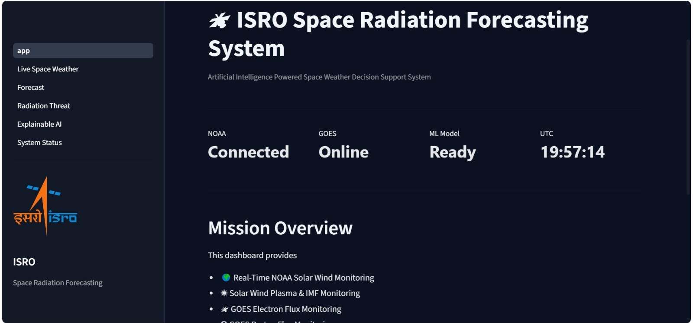
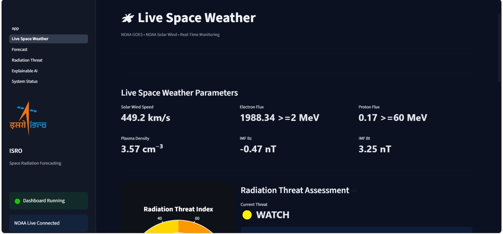
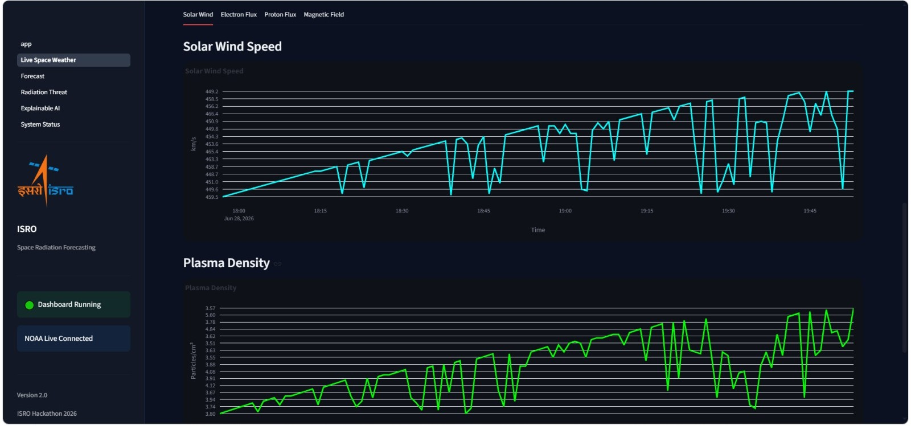
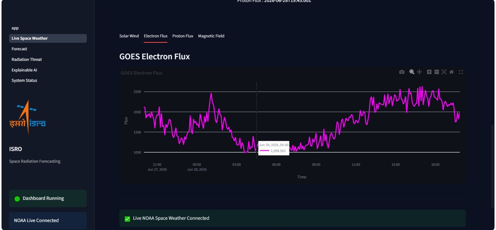
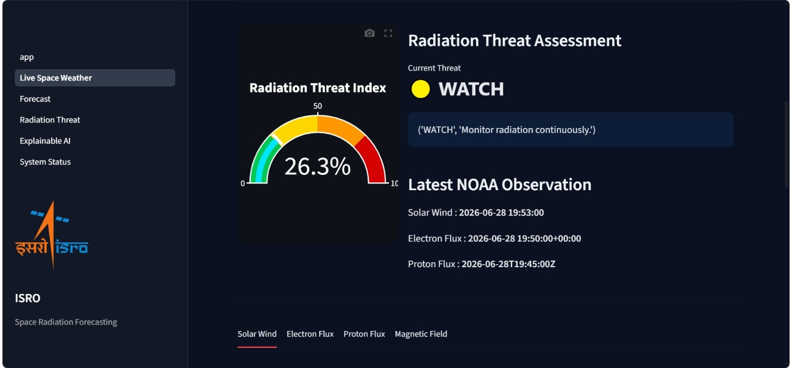
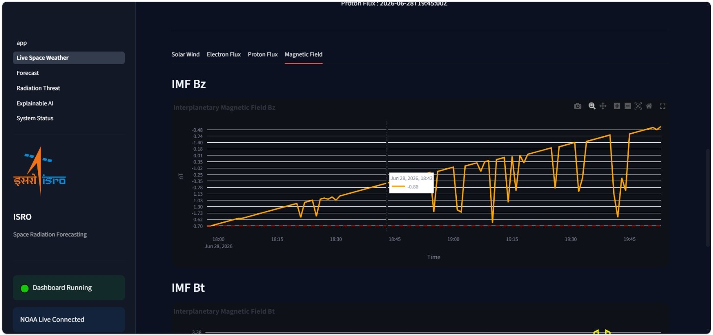
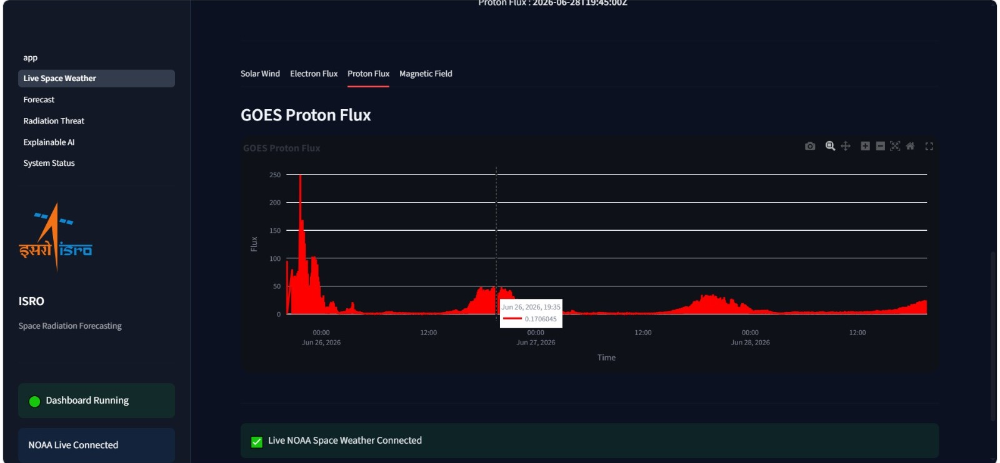

<div align="center">

# 🛰️ GaganiX

### AI-Driven Space Weather Radiation Forecasting System

**Multi-horizon energetic electron-flux forecasting for geostationary satellite environments**

<br>



<br><br>

[](https://www.python.org/)
[](https://pytorch.org/)
[](https://streamlit.io/)
[](https://pandas.pydata.org/)
[](#)
[](#)

</div>

---

## 🌌 Overview

**GaganiX** is an AI-driven space-weather forecasting system developed for energetic particle radiation forecasting near geostationary orbit.

It processes **11 years of satellite radiation and solar-wind data** and generates **30-min, 45-min, 6-hr and 12-hr** electron-flux forecasts through an interactive dashboard.

---

## ✨ Key Features

- 🛰️ **Satellite Radiation Analysis** — Processes energetic electron and proton observations from satellite datasets.
- ☀️ **Solar-Wind Analysis** — Incorporates solar-wind and interplanetary magnetic-field parameters.
- 🤖 **AI-Based Forecasting** — Machine-learning and deep-learning pipeline for energetic electron-flux prediction.
- ⏱️ **Multi-Horizon Forecasting** — Supports 30-minute, 45-minute, 6-hour and 12-hour prediction horizons.
- 📊 **Interactive Dashboard** — Streamlit interface for monitoring data, forecasts and radiation-related indicators.
- 🔬 **Scientific Data Pipeline** — CDF data reading, preprocessing, feature engineering, model training and validation.

---

# 📸 Project Dashboard

The system provides an interactive interface for examining radiation conditions and forecasting outputs.

<div align="center">


<br>

<sub><b>GaganiX — Interactive Space Weather Forecasting Dashboard</b></sub>

</div>

---

# 📈 Forecasting

The forecasting module provides multi-horizon predictions for energetic electron flux.

<div align="center">



<br>

<sub><b>Multi-horizon electron-flux forecasting output</b></sub>

</div>

---

# 📊 Data & Radiation Analysis

<div align="center">

<table>
<tr>

<td align="center">

<br>
<b>Satellite / Solar-Wind Data Visualization</b>
</td>

<td align="center">

<br>
<b>GOES Electron Flux Analysis</b>
</td>

</tr>
</table>

</div>

---

# ⚠️ Radiation Risk Analysis

<div align="center">



<br>

<sub><b>Radiation risk assessment and forecasting indicator</b></sub>

</div>

---

# 🔬 Additional Scientific Data

<div align="center">

<table>
<tr>

<td align="center">

<br>
<b>Interplanetary Magnetic Field Data</b>
</td>

<td align="center">

<br>
<b>GOES Proton Data</b>
</td>

</tr>
</table>

</div>

---

# 🧠 System Architecture

```mermaid
flowchart LR

    A[GOES Satellite Data]
    B[WIND Solar-Wind Data]

    A --> C[CDF Data Reader]
    B --> C

    C --> D[Data Preprocessing]

    D --> E[Data Cleaning]
    E --> F[Feature Engineering]

    F --> G[ML / Deep Learning Models]

    G --> H[30-Min Forecast]
    G --> I[45-Min Forecast]
    G --> J[6-Hour Forecast]
    G --> K[12-Hour Forecast]

    H --> L[Forecast Analysis]
    I --> L
    J --> L
    K --> L

    L --> M[Radiation Risk Analysis]

    M --> N[Streamlit Dashboard]

    N --> O[Engineering Visualization]
